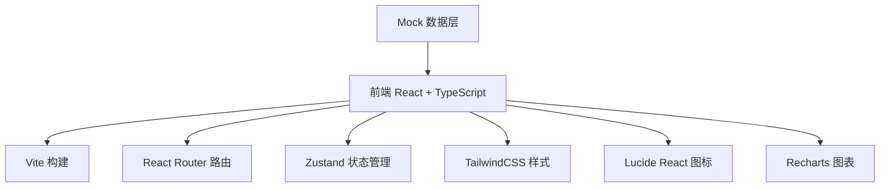
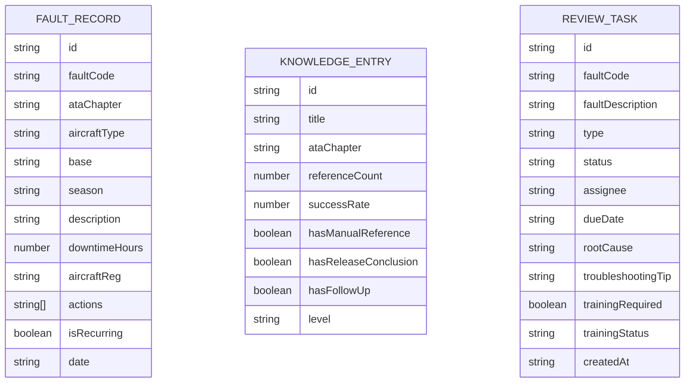

## 1. 架构设计



## 2. 技术描述

- **前端框架**：React 18 + TypeScript
- **构建工具**：Vite 5
- **路由管理**：react-router-dom 6
- **状态管理**：zustand
- **样式方案**：TailwindCSS 3
- **图表库**：Recharts
- **图标库**：lucide-react
- **后端**：无后端，使用 Mock 数据模拟
- **数据**：本地 Mock 数据，便于演示与开发

## 3. 路由定义

| 路由 | 页面 | 说明 |
|------|------|------|
| / | 故障热力页 | 默认首页，展示故障热力与关键指标 |
| /heatmap | 故障热力页 | 多维度筛选 + 热力图 + 故障列表 |
| /quality | 案例质量页 | 引用分析 + 低质条目 + 完整性检查 |
| /review | 复盘清单页 | 高频故障 + 超时记录 + 任务管理 |

## 4. 数据模型

### 4.1 数据实体



### 4.2 筛选条件模型

| 字段 | 类型 | 说明 |
|------|------|------|
| aircraftType | string[] | 机型筛选 |
| base | string[] | 基地筛选 |
| ataChapter | string[] | ATA 章节筛选 |
| season | string[] | 季节筛选 |
| faultCode | string | 故障代码搜索 |

## 5. 项目结构

```
src/
├── components/          # 公共组件
│   ├── Layout/          # 布局组件
│   ├── FilterBar/       # 筛选器组件
│   ├── MetricCard/      # 指标卡片
│   ├── HeatmapChart/    # 热力图
│   ├── ScatterChart/    # 散点图
│   └── StatusBadge/     # 状态标签
├── pages/               # 页面组件
│   ├── HeatmapPage/     # 故障热力页
│   ├── QualityPage/     # 案例质量页
│   └── ReviewPage/      # 复盘清单页
├── store/               # 状态管理
│   └── useFilterStore   # 筛选状态
├── data/                # Mock 数据
│   ├── faults.ts        # 故障数据
│   ├── knowledge.ts     # 知识条目
│   └── reviews.ts       # 复盘任务
├── types/               # 类型定义
│   └── index.ts
├── App.tsx
├── main.tsx
└── index.css
```

